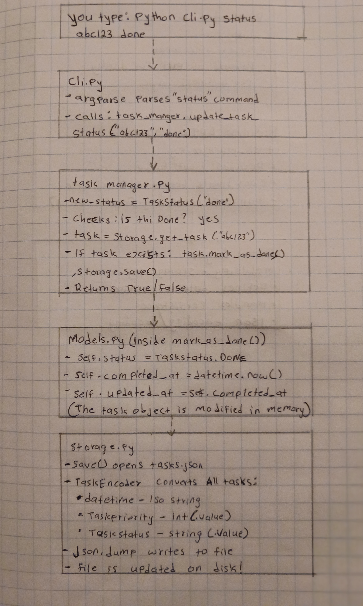
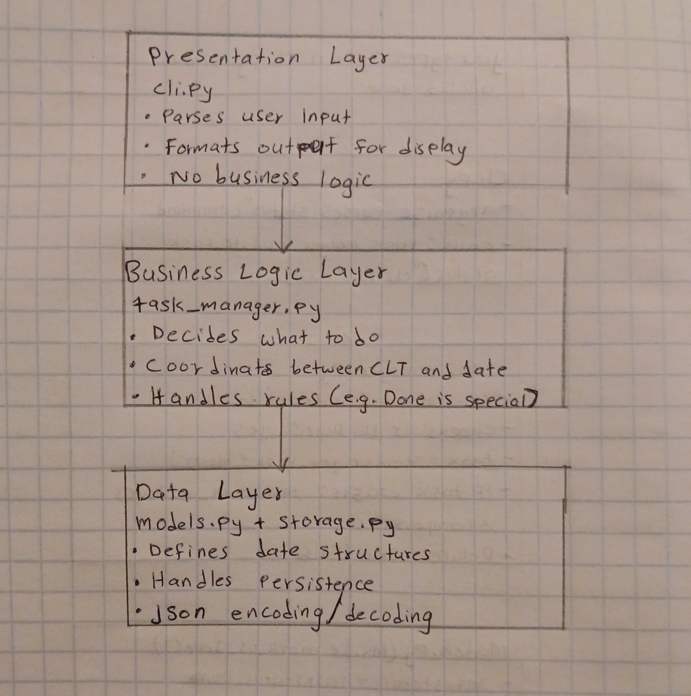

# Code Understanding Journal
## Python Task Manager

*Started: June 2, 2026*
*By: [Your Name]*

---

## Part 1: Understanding Task Creation & Status Updates

### First Impressions: What Even Are These Files?

Okay so I downloaded the Python Task Manager code and honestly at first I was like "what am I looking at??" There are 7 files and I had no idea what most of them did. I decided to just guess based on the names before I opened them:

| File | My Guess | What It Actually Does |
|------|----------|---------------------|
| `cli.py` | Probably where you type commands | YES! It's the command line interface |
| `task_manager.py` | Maybe the main brain? | YES! It's like the middleman between you and the data |
| `models.py` | No idea, maybe 3D models? | NO lol it's the blueprint for what a "task" looks like |
| `storage.py` | Probably saves stuff | YES! It saves to a JSON file |
| `test_task_manager.py` | Tests to make sure things work | YES! Unit tests |
| `README.md` | Instructions | YES! How to use the CLI |
| `__init__.py` | Empty file? | Yeah it's empty, just makes it a Python package |

### Figuring Out Task Creation

I started by trying to understand how a task gets created. I ran the command from the README:
```bash
python cli.py create "Buy groceries" --description "Milk, eggs, bread" --priority 2 --due "2024-06-10" --tags "shopping,food"
```

And it worked! It printed a task ID. But HOW? I had to dig through the code.

**Step 1: cli.py catches your command**

I found this in `cli.py`:
```python
if args.command == "create":
    tags = [tag.strip() for tag in args.tags.split(",")] if args.tags else []
    task_id = task_manager.create_task(
        args.title,
        args.description,
        args.priority,
        args.due,
        tags
    )
    if task_id:
        print(f"Created task with ID: {task_id}")
```

Okay so cli.py is just the messenger. It takes what you typed and hands it to `task_manager.create_task()`. That makes sense.

**Step 2: task_manager.py builds the task**

In `task_manager.py`:
```python
def create_task(self, title, description="", priority_value=2,
               due_date_str=None, tags=None):
    priority = TaskPriority(priority_value)
    due_date = None
    if due_date_str:
        try:
            due_date = datetime.strptime(due_date_str, "%Y-%m-%d")
        except ValueError:
            print("Invalid date format. Use YYYY-MM-DD")
            return None

    task = Task(title, description, priority, due_date, tags)
    task_id = self.storage.add_task(task)
    return task_id
```

Wait, I noticed something weird. It creates a `Task` object but then passes it to `storage.add_task()`. Why not just save it directly? I think `task_manager.py` is like the "manager" who decides WHAT to do, but `storage.py` actually handles the saving. That's a pattern I think? More on that later.

**Step 3: models.py — the actual Task class**

This is where the task object gets built:
```python
class Task:
    def __init__(self, title, description="", priority=TaskPriority.MEDIUM,
                 due_date=None, tags=None):
        self.id = str(uuid.uuid4())
        self.title = title
        self.description = description
        self.priority = priority
        self.status = TaskStatus.TODO
        self.created_at = datetime.now()
        self.updated_at = self.created_at
        self.due_date = due_date
        self.tags = tags or []
```

I had to look up `uuid.uuid4()` — it generates a random unique ID so every task has its own special identifier. That's pretty cool. Also I noticed `self.status = TaskStatus.TODO` — every new task starts as "todo" automatically. You don't have to set it.

**Step 4: storage.py saves it to a file**

```python
def add_task(self, task):
    self.tasks[task.id] = task
    self.save()
    return task.id
```

So it stores the task in a dictionary (key = task ID, value = task object) and then calls `save()` which writes everything to a JSON file called `tasks.json`.

### How Status Updates Work

I wanted to understand how marking a task as "done" works. The command is:
```bash
python cli.py status <task_id> done
```

I traced it through the code:

**In task_manager.py:**
```python
def update_task_status(self, task_id, new_status_value):
    new_status = TaskStatus(new_status_value)
    if new_status == TaskStatus.DONE:
        task = self.storage.get_task(task_id)
        if task:
            task.mark_as_done()
            self.storage.save()
            return True
    else:
        return self.storage.update_task(task_id, status=new_status)
```

**Wait, why is "done" special??** I noticed that for "done" it calls `task.mark_as_done()` and then `storage.save()`, but for other statuses it calls `storage.update_task(task_id, status=new_status)`. Why the difference??

I looked at `models.py`:
```python
def mark_as_done(self):
    self.status = TaskStatus.DONE
    self.completed_at = datetime.now()
    self.updated_at = self.completed_at
```

OH! Because when you mark something done, it records the EXACT time you completed it (`completed_at`). Other status changes don't need that. So "done" gets special treatment. That's a neat design choice I almost missed.

### Main Components I Found
1. **CLI (cli.py)** — Parses arguments, calls the right method
2. **TaskManager (task_manager.py)** — Business logic, decides how to handle requests
3. **Task Model (models.py)** — Data structure, defines what a task is
4. **TaskStorage (storage.py)** — Persistence layer, handles JSON file

### Execution Flow (Create)
```
User input → cli.py parses → TaskManager.create_task() → 
Task.__init__() creates object → TaskStorage.add_task() stores in dict → 
TaskStorage.save() writes to tasks.json
```

### Execution Flow (Status Update → DONE)
```
User input → cli.py parses → TaskManager.update_task_status() → 
TaskStorage.get_task() finds it → Task.mark_as_done() updates fields → 
TaskStorage.save() persists to JSON
```

### How Data Is Stored & Retrieved
- **In memory**: Dictionary `self.tasks` with task ID as key
- **On disk**: JSON file `tasks.json`
- **Conversion**: `TaskEncoder` turns Task objects into JSON (converts datetime to ISO strings, Enums to values)
- **Retrieval**: `TaskDecoder` turns JSON back into Task objects (converts ISO strings back to datetime, numbers back to Enums)

### Design Patterns I Think I Found
1. **Repository Pattern** — `TaskStorage` hides all the file/JSON details. The rest of the app doesn't care HOW tasks are saved. I think this is called Repository Pattern? I read about it online and it seems to fit.
2. **Model-View separation** — `models.py` is pure data, `cli.py` is pure interface. They don't mix.
3. **Command Pattern** — Each CLI subcommand is like a separate command object with its own arguments and behavior.

---

## Part 2: Deepening Understanding of Task Prioritization

### My Initial Understanding (Before I Really Looked)

I thought priority was just a number you type. Like, you put 1, 2, 3, or 4 and the program stores it as a number. Higher number = more important. Simple, right?

I also thought maybe you could put ANY number and it would just work. Like priority 99 for super-duper-urgent or something.

### What I Discovered After Looking Closer

**It's NOT just a number!** It's something called an `Enum` (Enumeration). Here's what I found in `models.py`:

```python
class TaskPriority(Enum):
    LOW = 1
    MEDIUM = 2
    HIGH = 3
    URGENT = 4
```

So it's like a named constant. The program knows that `1` means `LOW`, `2` means `MEDIUM`, etc. You can't just make up numbers. If you try priority 5, the program crashes with a `ValueError`!

I tested this by looking at the tests:
```python
def test_update_task_priority_invalid_priority(self):
    task_manager = TaskManager()
    invalid_priority = 5
    with self.assertRaises(ValueError):
        task_manager.update_task_priority(task_id, invalid_priority)
```

Yep, confirmed. You can't use 5. The Enum only allows 1-4.

### Guided Questions I Asked Myself (and Answered)

**Q1: How does the program show priorities when listing tasks?**

I looked at `cli.py` and found:
```python
priority_symbol = {
    TaskPriority.LOW: "!",
    TaskPriority.MEDIUM: "!!",
    TaskPriority.HIGH: "!!!",
    TaskPriority.URGENT: "!!!!"
}
```

So it uses exclamation marks! Low gets 1, medium gets 2, urgent gets 4. That's a nice visual way to show importance in the terminal.

**Q2: Can you filter tasks by priority?**

Yes! In `task_manager.py`:
```python
def list_tasks(self, status_filter=None, priority_filter=None, show_overdue=False):
    if priority_filter:
        priority = TaskPriority(priority_filter)
        return self.storage.get_tasks_by_priority(priority)
```

And in `storage.py`:
```python
def get_tasks_by_priority(self, priority):
    return [task for task in self.tasks.values() if task.priority == priority]
```

It loops through ALL tasks and only keeps the ones matching the priority. That's a list comprehension — I learned about those in class. Pretty elegant.

**Q3: Can you change priority after creating a task?**

Yes, there's a whole command:
```bash
python cli.py priority <task_id> 3
```

And the code:
```python
def update_task_priority(self, task_id, new_priority_value):
    new_priority = TaskPriority(new_priority_value)
    return self.storage.update_task(task_id, priority=new_priority)
```

It converts the number to a TaskPriority Enum and then updates it through storage.

**Q4: What happens if you give an invalid priority to the CLI?**

The CLI actually prevents this! In `cli.py`:
```python
create_parser.add_argument("-p", "--priority", type=int, choices=[1, 2, 3, 4], default=2)
```

The `choices=[1, 2, 3, 4]` means argparse will reject anything else. So the CLI stops you BEFORE the program even runs. That's smart defense.

### Key Insights
1. **Enums make the code safer** — You literally cannot use a bad value because Python will throw an error. The program protects itself.
2. **Number and name are linked** — `TaskPriority(3)` gives you `HIGH`, and `TaskPriority.HIGH.value` gives you `3`. You can go both directions.
3. **Filtering is simple** — Because every task uses the SAME Enum, comparing them is just `==`. No weird string matching needed.

### Misconceptions I Had (That Got Fixed)

| What I Thought | What Is Actually True |
|----------------|----------------------|
| Priority is just a plain number stored in JSON | It's stored as a number in JSON, but loaded back as an Enum. The program ALWAYS works with the Enum, not the raw number |
| You can use any priority number you want | Nope! Only 1-4. The Enum and CLI both block invalid values |
| Priority is just for display | No, it's used for filtering too. You can list only HIGH priority tasks |
| Changing priority is complicated | It's actually super simple — just one call to `storage.update_task()` |

---

## Part 3: Mapping Data Flow — Marking a Task as Complete

### Entry Points & Components

When you mark a task as complete, the journey starts at the command line and goes through several layers. Here's what I found:

**Entry point:** `python cli.py status <task_id> done`

**Components involved:**
1. `cli.py` — Parses the command
2. `task_manager.py` — Decides how to handle the "done" status
3. `models.py` — `Task.mark_as_done()` updates the task's internal state
4. `storage.py` — Persists the changes to `tasks.json`

### The Data Flow (My Hand-Drawn Diagram, Digitized)

*I drew this on paper first, then took a photo. Here's my actual diagram:*



*The diagram above shows the journey from typing the command to the file being saved on disk.*

### State Changes During Completion

I made a table to track what changes:

| Field | Before (In Progress) | After (Done) |
|-------|---------------------|--------------|
| `status` | `TaskStatus.IN_PROGRESS` | `TaskStatus.DONE` |
| `completed_at` | `None` | `datetime.now()` (e.g., 2024-06-02 14:30:00) |
| `updated_at` | Old timestamp | Same as `completed_at` |

**Important:** `created_at` and `due_date` do NOT change. Only status, completion time, and update time change.

### The Code That Handles State Changes

**task_manager.py (the decision maker):**
```python
def update_task_status(self, task_id, new_status_value):
    new_status = TaskStatus(new_status_value)
    if new_status == TaskStatus.DONE:
        task = self.storage.get_task(task_id)
        if task:
            task.mark_as_done()
            self.storage.save()
            return True
    else:
        return self.storage.update_task(task_id, status=new_status)
```

**models.py (the state changer):**
```python
def mark_as_done(self):
    self.status = TaskStatus.DONE
    self.completed_at = datetime.now()
    self.updated_at = self.completed_at
```

**storage.py (the persistence):**
```python
def save(self):
    with open(self.storage_path, 'w') as f:
        json.dump(list(self.tasks.values()), f, cls=TaskEncoder, indent=2)
```

**TaskEncoder (the translator):**
```python
class TaskEncoder(json.JSONEncoder):
    def default(self, obj):
        if isinstance(obj, Task):
            task_dict = obj.__dict__.copy()
            task_dict['priority'] = obj.priority.value
            task_dict['status'] = obj.status.value
            for key in ['created_at', 'updated_at', 'due_date', 'completed_at']:
                if task_dict.get(key) is not None:
                    task_dict[key] = task_dict[key].isoformat()
            return task_dict
```

I think the encoder is really clever. It takes Python objects (datetime, Enums) and turns them into plain text that JSON can understand. Then the decoder (`TaskDecoder`) does the reverse when loading.

### Potential Points of Failure

I tried to think about what could go wrong:

1. **Task ID doesn't exist**
   ```python
   task = self.storage.get_task(task_id)
   if task:  # If this is None...
   ```
   The method returns `False`. The CLI prints "Failed to update task status. Task not found." This is handled gracefully.

2. **File save fails**
   ```python
   except Exception as e:
       print(f"Error saving tasks: {e}")
   ```
   If the disk is full or permissions are wrong, the task gets marked done IN MEMORY but NOT SAVED. If the program restarts, the change is LOST. That's a real bug risk! I think maybe there should be a warning like "Task marked done but could not save to file."

3. **Two users saving at the same time**
   If two people run the CLI simultaneously and both save, one might overwrite the other's changes. The program reads the file at startup but doesn't lock it during save. This is called a race condition I think.

4. **Corrupted JSON file**
   If someone edits `tasks.json` by hand and messes up the format, `json.load()` will crash when the program starts. The error handling catches it but just prints a message. The tasks might be lost.

### How the Application Persists Changes

**The persistence path I traced:**
1. Task lives as a Python object in RAM (in `self.tasks` dictionary)
2. `mark_as_done()` changes the object's attributes in RAM
3. `storage.save()` converts ALL tasks to a JSON string
4. JSON string is written to `tasks.json` on the hard drive
5. On next startup, `storage.load()` reads `tasks.json`, uses `TaskDecoder` to rebuild Task objects

**One thing I noticed:** The program saves the ENTIRE file every time one task changes. Even if you just mark one task done, it rewrites ALL tasks. For a small app this is fine, but if you had thousands of tasks, this would be really slow. I wonder if there's a better way? Maybe append-only or a database?

---

## Part 4: Reflection & Presentation

### High-Level Architecture Overview

After all this digging, I think the app has a 3-layer architecture:



*I sketched this to show how the three layers are separated. If you wanted to add a web interface instead of the CLI, you'd only need to replace the top box!*

I like this separation because if you wanted to add a web interface instead of CLI, you could just replace `cli.py` and keep everything else the same. That's pretty cool.

### How the Three Key Features Work (My Simple Explanations)

**1. Task Creation**
You type a command with a title, description, priority number, due date, and tags. The CLI parses this and passes it to `TaskManager.create_task()`. The manager converts the priority number to a `TaskPriority` Enum, parses the date string to a `datetime` object, creates a `Task` object with a random UUID, and tells storage to save it. Storage adds it to a dictionary and writes all tasks to `tasks.json`.

**2. Task Prioritization**
Priorities are an Enum with exactly 4 levels: LOW(1), MEDIUM(2), HIGH(3), URGENT(4). The CLI enforces valid choices. The program uses these for filtering — you can list only tasks of a certain priority. When updating priority, the number is converted to an Enum and passed through the storage layer. The JSON file stores the numeric value, but the program always works with the named Enum for safety.

**3. Task Completion**
Marking a task as "done" is special! Unlike other status changes (which just call `storage.update_task()`), "done" triggers `task.mark_as_done()`. This method not only changes the status but also records the exact completion time in `completed_at`. Then `storage.save()` persists everything. The encoder converts datetime objects to ISO strings for JSON compatibility.

### One Interesting Design Pattern: The Repository Pattern

The coolest thing I found is what I think is the **Repository Pattern** in `storage.py`. 

**What it means:** `TaskStorage` acts like a librarian. The rest of the program doesn't know or care HOW tasks are saved. It could be a JSON file, a database, or even the cloud. The manager just asks the repository to:
- `add_task(task)` — "Please file this card"
- `get_task(id)` — "Find me this card"
- `get_all_tasks()` — "Show me everything"
- `save()` — "Lock it in the vault"

**Why it's cool:** If the developer wanted to switch from JSON to SQLite, they would only need to change `storage.py`. `task_manager.py` and `cli.py` wouldn't need ANY changes. That's the power of hiding implementation details!

### What I Found Most Challenging

Honestly? Understanding why `mark_as_done()` is different from other status updates.

At first I thought ALL status changes worked the same way. I assumed there was just one generic "update status" method that handled everything. But when I traced "done" vs "in_progress", I saw:

- `in_progress` → `storage.update_task(task_id, status=TaskStatus.IN_PROGRESS)`
- `done` → `task.mark_as_done()` then `storage.save()`

I was confused for like 20 minutes. Why two different paths?

Then I looked at `mark_as_done()` and saw it sets THREE things:
1. `status = DONE`
2. `completed_at = now`
3. `updated_at = now`

Other statuses only change ONE thing (the status). So "done" needs its own special method to bundle all three changes together. If the developer had used the generic `update_task()` for "done", they might have forgotten to set `completed_at`!

**How the prompts helped me:**
The exercise asked me to "map the complete data flow" for marking a task complete. If I hadn't been forced to trace EVERY step, I would have missed this special treatment. I would have just said "it changes the status" and moved on. But mapping the flow revealed the hidden complexity.

### My Process for Gaining Understanding

Here's what actually worked for me:

1. **Guess before you look** — I looked at file names and wrote down what I THOUGHT they did. Then I checked. Being wrong is fine — it makes you notice things.

2. **Follow one command all the way** — I picked "create" and traced it from the terminal through every file. Like following a single drop of water through a pipe system.

3. **Draw it out** — I literally sketched the flow on paper with boxes and arrows. When I got confused, I looked at my drawing instead of re-reading code.

4. **Ask "what if?"** — What if the task doesn't exist? What if the file is deleted? What if I type a bad date? The tests actually answered a lot of these.

5. **Compare similar things** — Why is "done" different from "in_progress"? Comparing them side-by-side revealed the design decision.

6. **Use the AI to check my understanding** — After I figured something out, I asked "Is this the Repository Pattern?" Getting confirmation (or correction) helped me learn the right terminology.

### What I'd Do Differently Next Time

- Start with the tests! `test_task_manager.py` actually shows you how everything is SUPPOSED to work. It's like a cheat sheet.
- Read the README first. I jumped straight into code and got lost. The README gives you the "user view" before you dive into the "developer view."
- Don't try to understand everything at once. I got overwhelmed trying to read all files simultaneously. Pick ONE feature and follow it through.

---

## Quick Reference (For My Future Self)

| Command | What It Does | Key Files |
|---------|-------------|-----------|
| `create` | Makes new task | cli.py → task_manager.py → models.py → storage.py |
| `list` | Shows tasks (can filter) | cli.py → task_manager.py → storage.py |
| `status` | Changes status (DONE is special!) | cli.py → task_manager.py → models.py → storage.py |
| `priority` | Changes priority (1-4 only) | cli.py → task_manager.py → storage.py |
| `due` | Changes deadline | cli.py → task_manager.py → storage.py |
| `tag/untag` | Adds/removes tags | cli.py → task_manager.py → storage.py |
| `show` | Shows one task | cli.py → task_manager.py → storage.py |
| `delete` | Removes task | cli.py → task_manager.py → storage.py |
| `stats` | Shows counts | cli.py → task_manager.py → storage.py |

---

*Journal completed: June 2, 2026*
*Total time spent: ~2 hours*
*Most confusing part: Why DONE is special*
*Coolest discovery: Repository Pattern in storage.py*
