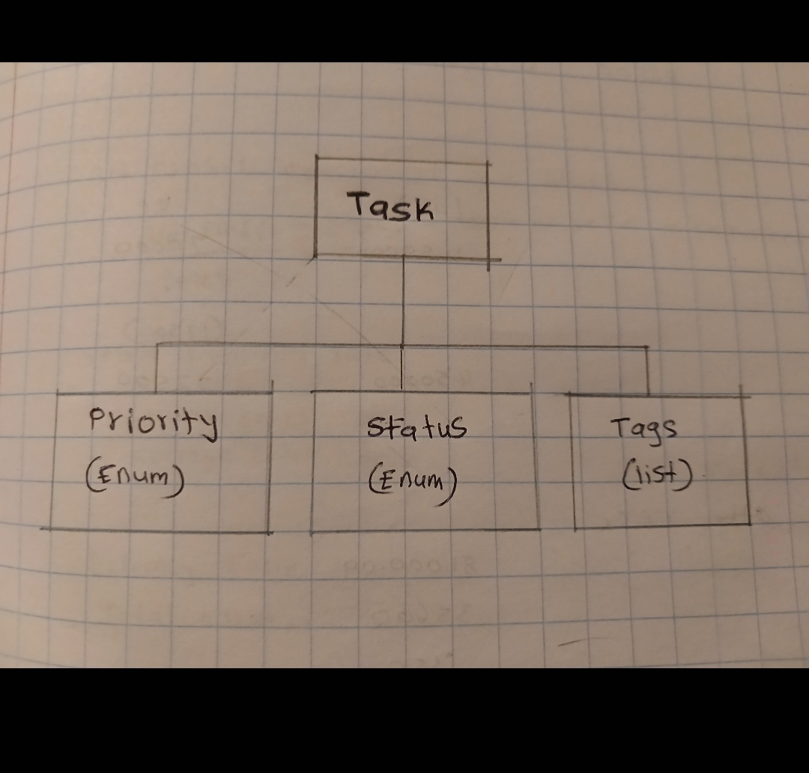
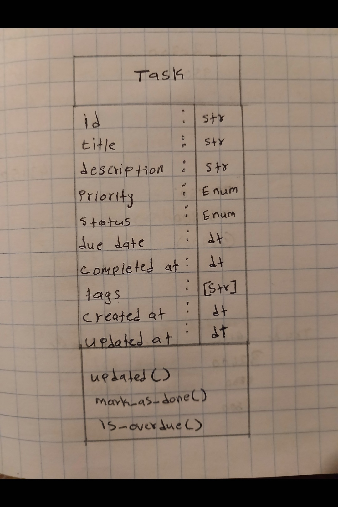

# Task Manager Exercise — My Discoveries

*This is my documentation for understanding the Task Manager codebase. I just joined this team and need to figure out how everything works.*

---

## Part 1: Understanding Project Structure

### My Initial Look

When I first opened the folder, I saw these files:
- `models.py`, `storage.py`, `task_manager.py`, `cli.py`
- `task_parser.py`, `task_priority.py`, `task_list_merge.py`
- A bunch of `test_*.py` files
- `README.md`

I was looking for config files like `package.json` or `requirements.txt` but there aren't any! The README says it only uses Python's standard library, which I thought was pretty cool — no installing anything extra.

### My First Guess at Organization

Before I looked closely, I wrote down what I thought each file did:

| File | My Guess |
|------|----------|
| `models.py` | Probably has the Task class and enums |
| `storage.py` | Saves stuff to disk, probably JSON |
| `task_manager.py` | The main logic, like a controller |
| `cli.py` | Command line interface, where you type commands |
| `task_parser.py` | Parses text into tasks maybe? |
| `task_priority.py` | Figures out which task is most important |
| `task_list_merge.py` | Merges two task lists together |

After actually reading them, I was mostly right except I didn't realize `task_parser.py` was for parsing casual text like "Buy milk !urgent #tomorrow" into actual task objects. That's actually really neat.

### Technologies I Found

- Python 3.11+
- `argparse` for CLI commands
- `json` for saving tasks to `tasks.json`
- `datetime` for dates
- `uuid` for unique IDs
- `enum` for TaskPriority and TaskStatus
- `unittest` for testing
- `re` for regex in the parser
- `copy` for deep copying in merge

I was surprised there's no database. Everything just goes into a JSON file. That's simple but I wonder if it slows down with lots of tasks.

### Main Components

1. **Models** (`models.py`): Defines `Task`, `TaskPriority`, and `TaskStatus`
2. **Storage** (`storage.py`): Reads/writes `tasks.json`, has custom JSON encoder/decoder
3. **TaskManager** (`task_manager.py`): Creates, updates, lists, deletes tasks
4. **CLI** (`cli.py`): Takes command line args and calls TaskManager methods
5. **Parser** (`task_parser.py`): Turns shorthand text into Task objects
6. **Priority** (`task_priority.py`): Calculates scores and sorts tasks
7. **Merge** (`task_list_merge.py`): Resolves conflicts between local and remote task lists

### AI Prompt I Used

I asked ChatGPT:

> "I just started on a new team and need to understand a Task Manager codebase. The files are models.py, storage.py, task_manager.py, cli.py, task_parser.py, task_priority.py, and task_list_merge.py. There's no requirements.txt or package.json — the README says it uses only Python standard library and stores data in a JSON file. I think it's a layered architecture with models, storage, business logic, and CLI. Can you analyze this and tell me: 1) what pattern this is, 2) the entry points, 3) what each component does, 4) any design patterns I should know?"

### What the AI Said vs What I Observed

**Things I got wrong:**
- I thought there might be a web framework hidden somewhere, but no — it's purely CLI
- I assumed there was a database connection, but it's just a JSON file
- I didn't realize the parser was for human-friendly text input until I read the docstring

**Entry points the AI pointed out:**
- `python cli.py` — where users interact
- `python -m unittest discover tests` — running tests
- `tasks.json` — the data file

**Architecture:** The AI said it's a **Layered Architecture**. That makes sense:
- CLI layer (user interface)
- Service layer (`task_manager.py`)
- Data access layer (`storage.py`)
- Domain layer (`models.py`)

**Key responsibilities:**
- `models.py`: knows WHAT a task is
- `storage.py`: knows HOW to persist tasks
- `task_manager.py`: knows WHAT TO DO with tasks
- `cli.py`: knows HOW to talk to the user
- `task_parser.py`: knows HOW to read shorthand text
- `task_priority.py`: knows WHICH task matters most right now
- `task_list_merge.py`: knows HOW to fix conflicts between two task versions

---

## Part 2: Finding Feature Implementation

### Scenario: Add "Task Export to CSV"

My team lead wants me to add CSV export. I need to find similar features first.

### My Search

I searched the codebase for:
- `export` — 0 results
- `csv` — 0 results
- `.csv` — 0 results
- `open(` — found in `storage.py`
- `write` — found in `storage.py`
- `json` — found in `storage.py`

So there's literally no export functionality at all. I have to build it from scratch.

### What I Found That Might Help

- `storage.py` already uses `open()`, `json.load()`, and `json.dump()` — so it knows file I/O
- `task_manager.py` has `get_all_tasks()` which returns every task
- `models.py` has `TaskEncoder` that turns tasks into dictionaries
- Python has a built-in `csv` module in the standard library, so no new dependencies needed

### My Hypothesis

I think CSV export should go in `task_manager.py` as a new method, and `cli.py` should get a new command. I thought about making a new `export.py` file, but the codebase is small and all the business logic lives in `task_manager.py` already, so adding a whole new file feels like overkill.

### Files That Need Changing

| File | Why |
|------|-----|
| `task_manager.py` | Add `export_to_csv()` method |
| `cli.py` | Add `export` subcommand |
| `README.md` | Document the new command |
| `test_task_manager.py` | Add unit tests |

### AI Prompt I Used

> "I need to add CSV export to a Task Manager. I searched and found no existing export code. I did find that storage.py handles JSON file I/O, task_manager.py has get_all_tasks(), and models.py has TaskEncoder. My plan is to add export_to_csv() to TaskManager and a CLI command. Can you guide me on where exactly this should live, what I can reuse, and what the implementation should look like? Also, what patterns should I follow from the existing code?"

### Implementation Plan

Based on the AI's suggestions and what I see in the code:

1. **In `task_manager.py`:**
   ```python
   import csv

   def export_to_csv(self, filename="tasks.csv"):
       tasks = self.storage.get_all_tasks()
       with open(filename, 'w', newline='') as f:
           writer = csv.writer(f)
           writer.writerow(['id', 'title', 'description', 'priority', 'status', 'due_date', 'tags'])
           for task in tasks:
               writer.writerow([
                   task.id,
                   task.title,
                   task.description,
                   task.priority.value,
                   task.status.value,
                   task.due_date.strftime('%Y-%m-%d') if task.due_date else '',
                   ','.join(task.tags)
               ])
       return filename
   ```

2. **In `cli.py`:** Add a new subparser for `export` with an optional `--filename` argument.

3. **Tests:** Follow the pattern in `test_task_manager.py` — probably mock `open()` or mock the storage.

### Related Components

- `README.md` needs updating
- `test_task_manager.py` needs new test cases
- `cli.py` argument parsing needs testing too

---

## Part 3: Understanding Domain Model

### Entities I Found

#### Task
The main thing. It has:
- `id` — UUID string, unique
- `title` — what the task is called
- `description` — more details
- `priority` — a `TaskPriority` enum value
- `status` — a `TaskStatus` enum value
- `created_at` — when it was made
- `updated_at` — when it was last changed
- `due_date` — deadline (can be None)
- `completed_at` — when it was finished (None until done)
- `tags` — list of strings

Methods:
- `update(**kwargs)` — changes fields and sets `updated_at` to now
- `mark_as_done()` — sets status to DONE and `completed_at` to now
- `is_overdue()` — True if `due_date < now` AND status isn't DONE

#### TaskPriority (Enum)
- LOW = 1
- MEDIUM = 2
- HIGH = 3
- URGENT = 4

#### TaskStatus (Enum)
- TODO = "todo"
- IN_PROGRESS = "in_progress"
- REVIEW = "review"
- DONE = "done"

### My First Diagram

I sketched this in my notes:



A Task HAS-A Priority, HAS-A Status, and HAS-MANY Tags.

### Business Logic I Noticed

1. **Overdue rule:** A task is only overdue if its due date passed AND it's not DONE. Done tasks can't be overdue.
2. **Done rule:** When you mark done, `completed_at` gets set automatically.
3. **Update rule:** Any update refreshes `updated_at`.
4. **Priority scoring:** In `task_priority.py`, tasks get a score based on priority weight, due date urgency, status penalties, special tags ("blocker", "critical", "urgent"), and recency.
5. **Merge rule:** In `task_list_merge.py`, when two versions of the same task exist, the newer one wins for most fields. BUT "DONE" always wins over not-done, regardless of timestamp. Tags get unioned (combined without duplicates).

### Questions I Had

- Why is there no CANCELLED or ABANDONED status? Seems like a natural thing to have.
- Can a task have multiple priorities? No, it's an enum so only one value.
- What if two people edit the same task at the exact same time? The merge logic uses timestamps, but what if timestamps are equal?

### AI Prompt I Used

> "I'm trying to understand the domain model of a Task Manager. Here's what I found:
> 
> Entities:
> - Task with id, title, description, priority, status, timestamps, due_date, completed_at, tags
> - TaskPriority: LOW=1, MEDIUM=2, HIGH=3, URGENT=4
> - TaskStatus: TODO, IN_PROGRESS, REVIEW, DONE
> 
> Rules I noticed:
> 1. Overdue = due_date passed AND not DONE
> 2. DONE sets completed_at
> 3. Updates refresh updated_at
> 4. Priority scoring combines priority, due date, status, tags, recency
> 5. Merge uses timestamp but DONE always wins
> 
> My diagram: Task has-a Priority, has-a Status, has-many Tags.
> 
> Can you verify my understanding, test me with 3 questions, tell me if I missed any hidden rules, and suggest how to improve my diagram?"

### AI's Questions and My Answers

**Q1:** If a task is due today and marked DONE, is it overdue?
**My answer:** No, because `is_overdue()` checks `self.status != TaskStatus.DONE`. Done tasks are never overdue.

**Q2:** Local task is IN_PROGRESS, updated 2 days ago. Remote is TODO, updated 1 day ago. What happens in merge?
**My answer:** Remote wins because it's newer. Merged status becomes TODO. BUT if remote was DONE (even if older), DONE would win anyway.

**Q3:** Task A has HIGH priority and tags ['critical', 'fun']. Task B has MEDIUM and tags ['blocker']. Which has higher priority score?
**My answer:** Task A probably wins because HIGH = 40 points + critical tag +8 = ~48. Task B = MEDIUM 20 + blocker +8 = ~28. But if Task B was overdue and Task A wasn't, Task B gets +35 and might win.

### Revised Diagram

After the AI suggested improvements, I made a better one:



### Domain Glossary

| Term | Meaning |
|------|---------|
| Task | Something you need to do |
| Priority | How important (1-4 scale) |
| Status | What stage it's in |
| Overdue | Past due date and not finished |
| Tag | Label for grouping |
| Due Date | Deadline |
| Completed At | Exact finish time |
| Merge | Combining two versions |
| Conflict | When versions disagree |
| Score | Number showing current urgency |

---

## Part 4: Practical Application

### The Rule to Implement

> "Tasks that are overdue for more than 7 days should be automatically marked as abandoned unless they are marked as high priority."

### Understanding the Rule

- If due_date was more than 7 days ago
- AND status isn't DONE
- AND priority isn't HIGH
- THEN change status to ABANDONED

### Problem: No ABANDONED Status Exists!

I checked `models.py` and `TaskStatus` only has:
- TODO
- IN_PROGRESS
- REVIEW
- DONE

So I need to add ABANDONED first.

### Files to Modify

| File | What to Change |
|------|----------------|
| `models.py` | Add `ABANDONED = "abandoned"` to TaskStatus |
| `models.py` | Add `is_abandoned_eligible()` method to Task |
| `task_manager.py` | Add `check_abandoned_tasks()` method |
| `cli.py` | Add `check-abandoned` command |
| `test_task_manager.py` | Add tests |

### My Implementation Plan

**1. Add status to models.py:**
```python
class TaskStatus(Enum):
    TODO = "todo"
    IN_PROGRESS = "in_progress"
    REVIEW = "review"
    DONE = "done"
    ABANDONED = "abandoned"
```

**2. Add eligibility check to Task:**
```python
def is_abandoned_eligible(self):
    if not self.due_date:
        return False
    if self.status in (TaskStatus.DONE, TaskStatus.ABANDONED):
        return False
    if self.priority == TaskPriority.HIGH:
        return False
    seven_days_ago = datetime.now() - timedelta(days=7)
    return self.due_date < seven_days_ago
```

Wait — should URGENT also be exempt? The rule says "high priority" and URGENT (4) is higher than HIGH (3). I think URGENT should be exempt too, but I need to ask my team.

**3. Add method to TaskManager:**
```python
def check_abandoned_tasks(self):
    tasks = self.storage.get_all_tasks()
    count = 0
    for task in tasks:
        if task.is_abandoned_eligible():
            self.storage.update_task(task.id, status=TaskStatus.ABANDONED)
            count += 1
    return count
```

**4. Add CLI command:**
```python
abandon_parser = subparsers.add_parser("check-abandoned", help="Mark old overdue tasks as abandoned")
```

### Questions for My Team

Before I actually code this, I need to ask:

1. **Does URGENT count as "high priority"?** The rule says "high priority" but we have HIGH=3 and URGENT=4. Should both be exempt?

2. **Should ABANDONED be a status or a tag?** Adding a new status changes the enum everywhere. A tag might be safer but doesn't fit the existing pattern as well.

3. **When should this run?** Every time someone lists tasks? Only when they run a special command? Automatically daily?

4. **Should abandoned tasks show in normal lists?** Or be hidden unless specifically requested?

5. **Can abandoned tasks be revived?** If someone updates one, does it come back to life?

### Reflection

**How did AI prompts help?**
- Part 1: The prompt made me look at entry points and patterns instead of just reading files randomly. I understood the "layered sandwich" architecture.
- Part 2: The prompt helped me realize there was NO export feature to copy from. I knew I had to build from scratch, but I also knew exactly which pieces to reuse.
- Part 3: The AI test questions made me think about edge cases I would have missed, like "DONE always wins in merges" being a hidden business rule.

**What I'm still unsure about:**
1. **Business logic vs application logic:** Is checking abandonment eligibility a "model" job or a "manager" job? I put it in both (model checks, manager executes) but I'm not sure that's right.
2. **Testing:** The existing tests use a lot of mocks. I'm not totally confident I understand when to use Mock vs MagicMock for my new feature.
3. **Dates:** The code uses `datetime.now()` everywhere. Should we use timezone-aware dates? The exercise doesn't mention timezones.

**Next steps:**
1. Run all existing tests to make sure they pass before I change anything
2. Trace through a command like `python cli.py create "Test" --priority 3` to see the full flow: CLI → Manager → Storage → JSON
3. Maybe add a smaller feature first (like duplicate task) to practice the pattern before tackling the big abandoned rule
4. Read the test files more carefully — they show exactly how the code is supposed to behave

---

## Quick Reference (for me)

| Want to... | Look in... | Call... |
|------------|-----------|---------|
| Create task | `task_manager.py` | `create_task()` |
| Save data | `storage.py` | `save()` |
| Check overdue | `models.py` | `task.is_overdue()` |
| Parse text | `task_parser.py` | `parse_task_from_text()` |
| Sort tasks | `task_priority.py` | `sort_tasks_by_importance()` |
| Merge lists | `task_list_merge.py` | `merge_task_lists()` |
